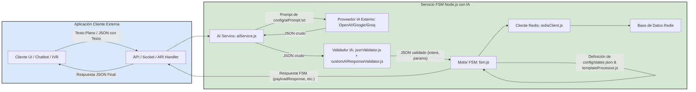

# Documento de Funcionamiento y Casos de Uso del Servicio FSM con IA

## 1. Introducción al Servicio FSM con IA

Este servicio de Máquina de Estados Finitos (FSM) ahora integra un **procesamiento de lenguaje natural mediante Inteligencia Artificial (IA)** para interpretar la entrada del usuario antes de que la FSM actúe. Su propósito es orquestar flujos conversacionales complejos, donde la IA primero estructura la entrada del usuario (texto) en una intención (`intent`) y parámetros (`parameters`), y luego la FSM gestiona el diálogo basado en esta información estructurada.

**Integración:**
El servicio puede ser integrado a través de:
*   **API RESTful (Texto Plano -> JSON):** A través de un endpoint HTTP (`POST /fsm/:sessionId`) que ahora recibe **texto plano** (`text/plain`). Este texto es procesado por la IA, y el JSON resultante alimenta a la FSM. La respuesta final de la FSM se devuelve como JSON.
*   **Sockets UNIX (JSON con Texto -> JSON):** El cliente envía un JSON con `sessionId` y `textInput`. `textInput` es procesado por la IA. La respuesta de la FSM se devuelve como JSON.
*   **Asterisk ARI (Voz/DTMF -> Texto -> JSON):** La entrada de voz (requiere ASR externa o DTMF interpretado) se convierte en texto, se procesa por la IA, y luego la FSM guía la llamada.

**Componentes Clave:**
*   **Servicio de IA (`src/aiService.js`):** (NUEVO) Interactúa con proveedores de IA (OpenAI, Google Gemini, Groq) usando un prompt (`config/aiPrompt.txt`) para convertir el texto del usuario en un JSON con `intent` y `parameters`.
*   **Validación de IA (`src/jsonValidator.js`, `config/aiResponseSchema.json`, `config/customAIResponseValidator.js`):** (NUEVO) Valida la salida de la IA.
*   **Motor FSM (`src/fsm.js`):** El núcleo lógico que procesa la `intent` y `parameters` (ahora provenientes de la IA), gestiona transiciones y mantiene el estado de la sesión.
*   **Configuración de Estados (`config/states.json`):** Define los estados y la lógica de la FSM.
*   **Redis (`src/redisClient.js`):** Almacena sesiones FSM y logs de interacciones de IA y FSM.
*   **Logging (`src/logger.js`):** (NUEVO) Logging estructurado con `pino`.

## 2. Arquitectura General Actualizada



**Flujo de Datos Simplificado:**
1.  La **Aplicación Cliente Externa** envía texto de usuario al **Servicio FSM con IA** a través de una de sus interfaces.
2.  La interfaz correspondiente pasa el texto al **AI Service**.
3.  El **AI Service** envía el texto y un prompt al **Proveedor de IA Externo**.
4.  El Proveedor de IA devuelve un JSON (con `intent` y `parameters`).
5.  Este JSON es validado por el **Validador IA**.
6.  El JSON validado se pasa como entrada al **Motor FSM**.
7.  El **Motor FSM** procesa la entrada, interactúa con Redis para la sesión, y usa `config/states.json` y `templateProcessor.js` para generar su respuesta.
8.  La respuesta de la FSM se devuelve a la **Aplicación Cliente Externa**.
9.  Todas las etapas importantes (entrada de texto, E/S de IA, E/S de FSM) se registran en Redis.

## 3. Flujo de Interacción Típico

### Solicitud (Entrada de Texto a la API)

La aplicación externa contacta al servicio.
*   **Endpoint:** `POST /fsm/:sessionId`
    *   `:sessionId` es un identificador único para la conversación.
*   **Headers:** `Content-Type: text/plain`
*   **Cuerpo (Body) de la Solicitud:**
    ```
    Hola, quiero agendar una cita para cardiología mañana a las 10 AM. Mi nombre es Juan Pérez.
    ```

### Proceso Interno (IA + FSM)

1.  **Recepción y Logging Inicial**: El `apiServer.js` recibe el texto. Se registra en Redis.
2.  **Procesamiento por IA (`aiService.js`)**:
    *   Texto: `"Hola, quiero agendar una cita para cardiología mañana a las 10 AM. Mi nombre es Juan Pérez."`
    *   Prompt: Contenido de `config/aiPrompt.txt`.
    *   Salida Esperada de la IA:
        ```json
        {
          "intent": "schedule_appointment",
          "parameters": {
            "medical_specialty": "cardiología",
            "appointment_date": "mañana",
            "appointment_time": "10 AM",
            "caller_name": "Juan Pérez"
          }
        }
        ```
    *   Esta salida de la IA se registra en Redis.
3.  **Validación de IA**: El JSON anterior se valida contra `config/aiResponseSchema.json` y `config/customAIResponseValidator.js`. Asumamos que pasa.
4.  **Entrada a FSM**: El JSON validado se registra en Redis como `fsm_input`. Se llama a `fsm.processInput()` con `sessionId`, `intent: "schedule_appointment"`, y los `parameters` extraídos.
5.  **Proceso FSM (`fsm.js`)**:
    *   Recupera/Inicializa Sesión para `sessionId`.
    *   Fusiona los `parameters` de la IA con los de la sesión.
    *   Carga la configuración del estado actual (ej: `1_welcome_and_age`).
    *   Evalúa Transiciones: La `intent: "schedule_appointment"` podría no causar una transición inmediata si faltan parámetros requeridos por el estado actual (como `patient_age` en `1_welcome_and_age`).
    *   Determina `nextStateId` (ej: sigue siendo `1_welcome_and_age`).
    *   Identifica `parametersToCollect` (ej: `required: ["patient_age"]` si `patient_age` no vino de la IA).
    *   Procesa `payloadResponse` del estado `1_welcome_and_age` usando `templateProcessor.js` y los `collectedParameters` (que ahora incluyen `caller_name`, `medical_specialty`, etc.).
        *   Ej: `payloadResponse: { "greeting": "Hola {{caller_name}}, bienvenido. Veo que quieres una cita para {{medical_specialty}}. Para continuar, ¿podrías decirme tu edad?" }`
    *   Actualiza y guarda la sesión en Redis (asíncronamente).
6.  **Respuesta (JSON Saliente de la API)**:
    ```json
    {
      "sessionId": "valor_del_sessionId_procesado",
      "currentStateId": "1_welcome_and_age", // o el estado al que se llegó
      "nextStateId": "1_welcome_and_age",    // o el estado al que se llegó
      "parametersToCollect": { "required": ["patient_age"], "optional": [] },
      "payloadResponse": {
        "greeting": "Hola Juan Pérez, bienvenido. Veo que quieres una cita para cardiología. Para continuar, ¿podrías decirme tu edad?"
      },
      "collectedParameters": {
        "caller_name": "Juan Pérez",
        "medical_specialty": "cardiología",
        "appointment_date": "mañana",
        "appointment_time": "10 AM"
        // ...otros parámetros de sesión si existían
      }
    }
    ```
    *   Esta respuesta final también se registra en Redis.

### Proceso Interno de la FSM (sin cambios fundamentales en su lógica central)

Al recibir una solicitud, el motor FSM realiza los siguientes pasos:
1.  **Recuperar/Inicializar Sesión:** Usa el `sessionId` para buscar una sesión existente en Redis. Si no existe, crea una nueva sesión, estableciendo el estado actual al `initialState` definido en `config/states.json` y un objeto de parámetros vacío.
2.  **Fusionar Parámetros:** Combina los `parameters` recibidos en la solicitud actual con los parámetros ya acumulados en la sesión de Redis. Los nuevos valores sobrescriben los antiguos si las claves son las mismas.
3.  **Cargar Configuración del Estado:** Obtiene la definición completa del estado actual (`currentStateId` de la sesión) desde la configuración cargada de `config/states.json`.
4.  **Evaluar Transición:**
    *   Primero, verifica si la `intent` recibida coincide con alguna condición de `intent` en las `transitions` del estado actual. Las transiciones por intención tienen prioridad.
    *   Si no hay transición por intención, evalúa otras transiciones basadas en si todos los `parameters.required` del estado actual han sido recolectados (`allParametersMet: true`).
    *   Si ninguna transición específica coincide pero todos los parámetros requeridos están completos, se usa el `defaultNextState` (si está definido).
    *   Si no hay cambio de estado, el `nextStateId` será el mismo que el `currentStateId`.
5.  **Determinar `nextStateId`:** El resultado del paso anterior es el ID del siguiente estado.
6.  **Identificar `parametersToCollect`:** Para el `nextStateId` determinado, la FSM consulta su definición en `config/states.json` y construye el objeto `parametersToCollect`. Este objeto contendrá:
    *   `required`: Un array de IDs de parámetros que son obligatorios para el *nuevo* estado y que *aún no existen* en la sesión acumulada o tienen valores nulos/vacíos.
    *   `optional`: Un array de IDs de parámetros opcionales para el *nuevo* estado que *aún no existen* en la sesión.
7.  **Obtener `apiHooks`:** Se recupera el objeto `apiHooks` de la definición del `nextStateId`. Este objeto especifica qué APIs externas deberían ser llamadas en diferentes puntos del ciclo de vida de este nuevo estado (ej: `onEnterState`, `beforeCollectingParameters`, `afterParametersCollected`).
8.  **Actualizar y Guardar Sesión:** El estado de la sesión en Redis se actualiza con el nuevo `currentStateId` (que ahora es el `nextStateId`), y la colección completa y actualizada de `parameters`. El historial de estados también se actualiza.

### Respuesta (JSON Saliente de la API)

La FSM responde a la aplicación externa con la siguiente estructura JSON:
```json
{
  "sessionId": "valor_del_sessionId_procesado",
  "currentStateId": "id_del_estado_despues_del_procesamiento",
  "nextStateId": "id_del_estado_al_que_se_transito", // Generalmente igual a currentStateId
  "parametersToCollect": {
    "required": ["param_a_pedir_al_usuario_1", "param_a_pedir_2"],
    "optional": ["param_opcional_a_pedir_1"]
  },
  "apiHooks": {
    "onEnterState": ["api_id_a_llamar_al_entrar_al_estado", "otra_api_al_entrar"],
    "beforeCollectingParameters": ["api_id_a_llamar_antes_de_pedir_params"],
    "afterParametersCollected": ["api_id_a_llamar_despues_de_recibir_params"]
    // Otros hooks definidos en states.json para este estado (pueden ser arrays vacíos)
  },
  "collectedParameters": {
    "nombre_parametro_1": "valor_recolectado_1", // De la entrada actual
    "parametro_acumulado_previamente": "valor_previo_de_la_sesion",
    "nombre_parametro_2": "valor_recolectado_2" // De la entrada actual
    // Todos los parámetros acumulados en la sesión hasta el momento
  }
}
```
*   `sessionId`: El mismo ID de sesión de la solicitud.
*   `currentStateId` / `nextStateId`: El ID del estado en el que la FSM se encuentra ahora, después de procesar la entrada.
*   `parametersToCollect`: Indica a la aplicación externa qué información necesita solicitar al usuario a continuación.
*   `apiHooks`: Guía a la aplicación externa sobre qué APIs debe invocar y en qué momento conceptual del procesamiento del estado actual. La FSM *no* llama a estas APIs.
*   `collectedParameters`: Proporciona una vista completa de todos los datos recolectados para esta sesión hasta el momento, lo cual puede ser útil para la aplicación externa (ej: para mostrar un resumen al usuario).

## 4. Casos de Ejemplo Detallados

(Usando el `config/states.json` con `apiHooks` previamente definido)

### Caso 1: Agendamiento Exitoso (Flujo Lineal)

**Paso 1: Inicio de la conversación**
*   **App Externa -> FSM (POST /fsm/session123):**
    ```json
    // Primera interacción, sin intent ni parámetros previos
    {}
    ```
*   **FSM -> App Externa:**
    ```json
    {
      "sessionId": "session123",
      "currentStateId": "1_welcome_and_age",
      "nextStateId": "1_welcome_and_age",
      "parametersToCollect": { "required": ["patient_age"], "optional": ["caller_name"] },
      "apiHooks": {
        "onEnterState": ["api_log_interaction_start"],
        "beforeCollectingParameters": ["api_fetch_age_prompt_variations"],
        "afterParametersCollected": ["api_check_age_eligibility", "api_log_age_provided"]
      },
      "collectedParameters": {}
    }
    ```
    *   *App Externa ahora*: Llama `api_log_interaction_start`. Llama `api_fetch_age_prompt_variations`. Presenta bienvenida y pide edad (y opcionalmente nombre).

**Paso 2: Usuario provee la edad**
*   **App Externa -> FSM (POST /fsm/session123):**
    ```json
    {
      "parameters": { "patient_age": 30 }
    }
    ```
*   *App Externa antes de llamar a FSM*: Ya llamó `api_check_age_eligibility` y `api_log_age_provided` (del `afterParametersCollected` del estado anterior). Supongamos que `api_check_age_eligibility` fue exitosa y no generó una `intent` de inelegibilidad.
*   **FSM -> App Externa:**
    ```json
    {
      "sessionId": "session123",
      "currentStateId": "2_get_patient_id",
      "nextStateId": "2_get_patient_id",
      "parametersToCollect": { "required": ["patient_id_number"], "optional": ["id_document_type"] },
      "apiHooks": {
        "onEnterState": ["api_log_enter_get_id_state"],
        "beforeCollectingParameters": ["api_verify_id_prerequisites", "api_get_id_input_instructions"],
        "afterParametersCollected": ["api_validate_id_format", "api_log_id_provided"]
      },
      "collectedParameters": { "patient_age": 30 }
    }
    ```
    *   *App Externa ahora*: Llama APIs de `onEnterState` y `beforeCollectingParameters` para el estado `2_get_patient_id`. Pide el número de identificación.

**... y así sucesivamente hasta la confirmación.**

**Paso N: Confirmación Final**
*   Supongamos que se llega al estado `7_confirmation_and_closing` después de que `api_book_appointment_slot` (del `afterParametersCollected` del estado `6_get_appointment_time`) fue exitosa y la app externa envió `intent: "appointment_booked_success"`.
*   **FSM -> App Externa:**
    ```json
    {
      "sessionId": "session123",
      "currentStateId": "7_confirmation_and_closing",
      "nextStateId": "7_confirmation_and_closing",
      "parametersToCollect": { "required": [], "optional": [] }, // Nada más que pedir
      "apiHooks": {
        "onEnterState": ["api_send_confirmation_message", "api_log_interaction_complete"],
        "beforeCollectingParameters": [],
        "afterParametersCollected": []
      },
      "collectedParameters": { /* todos los datos de la cita */ }
    }
    ```
    *   *App Externa ahora*: Llama `api_send_confirmation_message` y `api_log_interaction_complete`. Muestra confirmación y finaliza.

### Caso 2: Agendamiento Fallido (Ej: Slot de Hora No Disponible)

*   **Contexto**: La conversación está en el estado `6_get_appointment_time`. El usuario ha proporcionado una hora.
*   **App Externa**:
    1.  Recibió `apiHooks.afterParametersCollected: ["api_book_appointment_slot"]` del estado `6_get_appointment_time`.
    2.  Llama a `api_book_appointment_slot` con la hora proporcionada.
    3.  La API `api_book_appointment_slot` falla, indicando que el slot no está disponible.
*   **App Externa -> FSM (POST /fsm/sessionXYZ):**
    ```json
    {
      "intent": "appointment_slot_unavailable", // Intención basada en el fallo de la API
      "parameters": { "appointment_time": "3:00 PM" } // Parámetro que se intentó usar
    }
    ```
*   **FSM (evaluando `6_get_appointment_time` con `intent: "appointment_slot_unavailable"`) -> App Externa:**
    ```json
    {
      "sessionId": "sessionXYZ",
      "currentStateId": "6_retry_appointment_time", // Transición a estado de reintento
      "nextStateId": "6_retry_appointment_time",
      "parametersToCollect": { "required": ["appointment_time"], "optional": [] }, // Pedir hora de nuevo
      "apiHooks": {
        "onEnterState": ["api_log_time_retry_event", "api_fetch_alternative_slots"],
        "beforeCollectingParameters": [],
        "afterParametersCollected": ["api_book_appointment_slot"] // De nuevo, intentar reservar
      },
      "collectedParameters": { /* ...otros datos..., "appointment_time": "3:00 PM" */ }
    }
    ```
    *   *App Externa ahora*: Llama APIs de `onEnterState` (ej: para informar al usuario que la hora no está disponible y quizás sugerir alternativas basadas en `api_fetch_alternative_slots`). Luego, pide una nueva hora.

### Caso 3: Derivación a Agente Humano (Cambio de Intención)

*   **Contexto**: La conversación está en el estado `3_get_specialty`. La FSM acaba de pedir la especialidad.
*   **Usuario dice**: "Quiero hablar con una persona".
*   **App Externa** (interpreta la frase del usuario como una intención de transferir) **-> FSM (POST /fsm/sessionABC):**
    ```json
    {
      "intent": "request_human_agent",
      "parameters": {} // No se recogieron nuevos parámetros relevantes para la especialidad
    }
    ```
*   **FSM (evaluando `3_get_specialty` con `intent: "request_human_agent"`) -> App Externa:**
    ```json
    {
      "sessionId": "sessionABC",
      "currentStateId": "99_transfer_to_human", // Transición directa por intención
      "nextStateId": "99_transfer_to_human",
      "parametersToCollect": { "required": [], "optional": [] },
      "apiHooks": {
        "onEnterState": ["api_initiate_transfer_to_human_agent", "api_log_transfer_request"],
        "beforeCollectingParameters": [],
        "afterParametersCollected": []
      },
      "collectedParameters": { /* parámetros acumulados hasta antes de pedir especialidad */ }
    }
    ```
    *   *App Externa ahora*: Llama `api_initiate_transfer_to_human_agent` y `api_log_transfer_request`. Procede con la transferencia al agente humano. Los `collectedParameters` pueden pasarse al agente humano para darle contexto.

### Caso 4: Error de Validación de Parámetro (Ej: Cédula Inválida por API externa)

*   **Contexto**: La FSM está en el estado `2_get_patient_id`, y ha pedido la cédula. El usuario la ingresa.
*   **App Externa**:
    1.  Recibió `apiHooks.afterParametersCollected: ["api_validate_id_format", "api_log_id_provided"]` del estado `2_get_patient_id`.
    2.  Recolecta la cédula del usuario, ej: "123".
    3.  Llama a `api_validate_id_format` con "123". Esta API determina que "123" es inválida.
*   **App Externa -> FSM (POST /fsm/sessionDEF):**
    ```json
    {
      "intent": "id_invalid_system_detected", // Intención generada por la app externa
      "parameters": { "patient_id_number": "123" }
    }
    ```
*   **FSM (evaluando `2_get_patient_id` con `intent: "id_invalid_system_detected"`) -> App Externa:**
    ```json
    {
      "sessionId": "sessionDEF",
      "currentStateId": "2_get_patient_id_retry_invalid",
      "nextStateId": "2_get_patient_id_retry_invalid",
      "parametersToCollect": { "required": ["patient_id_number"], "optional": ["id_document_type"] },
      "apiHooks": {
        "onEnterState": ["api_log_id_retry_event"],
        "beforeCollectingParameters": ["api_get_id_input_retry_instructions"],
        "afterParametersCollected": ["api_validate_id_format", "api_log_id_provided_after_retry"]
      },
      "collectedParameters": { /* ...otros datos..., "patient_id_number": "123" */ }
    }
    ```
    *   *App Externa ahora*: Llama APIs de `onEnterState` y `beforeCollectingParameters` para el estado de reintento (ej: para informar al usuario del error y volver a pedir la cédula).

## 5. Manejo de `apiHooks` por la Aplicación Externa

Es crucial entender que **la FSM no ejecuta las APIs listadas en `apiHooks`**. Simplemente las especifica. La aplicación cliente externa es responsable de:

1.  **Recibir la Respuesta de la FSM:** Parsear el JSON y extraer `nextStateId`, `parametersToCollect`, y `apiHooks`.
2.  **Ejecutar APIs `onEnterState`:** Si el array `apiHooks.onEnterState` contiene IDs de API, la aplicación externa debe invocarlas. Estas son típicamente para logging, inicialización o para obtener datos que se mostrarán antes de pedir nuevos parámetros.
3.  **Ejecutar APIs `beforeCollectingParameters`:** Si `apiHooks.beforeCollectingParameters` tiene APIs, invocarlas. Podrían ser para preparar dinámicamente las preguntas o instrucciones para el usuario.
4.  **Solicitar Datos al Usuario:** Basándose en el contenido de `parametersToCollect` (tanto `required` como `optional`), interactuar con el usuario para obtener la información necesaria.
5.  **Ejecutar APIs `afterParametersCollected`:** Una vez que el usuario ha proporcionado los datos (o algunos de ellos), si `apiHooks.afterParametersCollected` contiene APIs, la aplicación externa debe invocarlas. Estas APIs a menudo realizan validaciones sobre los datos recién ingresados o ejecutan acciones basadas en ellos (como `api_book_appointment_slot`).
    *   El resultado de estas APIs puede influir en la siguiente llamada a la FSM (ej: generando una `intent` como `id_invalid_system_detected` o `appointment_slot_unavailable`).
6.  **Enviar Siguiente Solicitud a la FSM:** Construir un nuevo JSON con los nuevos `parameters` recolectados y cualquier `intent` que se haya derivado de la interacción del usuario o de los resultados de las llamadas a las APIs en el paso anterior.

Este ciclo se repite hasta que la conversación alcanza un estado final (un estado sin más transiciones o `defaultNextState`).
